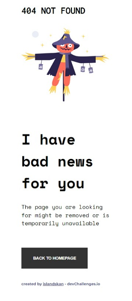
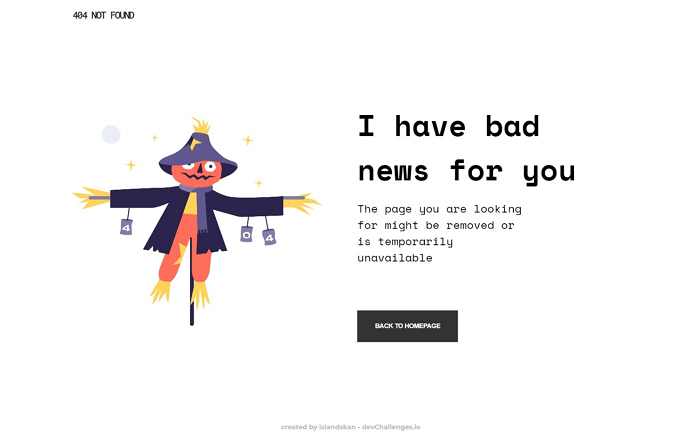

# Devchallenges: 404 NOT FOUND page

<!-- TABLE OF CONTENTS -->

## Table of Contents

- [Overview](#overview)
- [Built With](#built-with)
- [Features](#features)
- [Contact](#contact)
- [Acknowledgements](#acknowledgements)

<!-- OVERVIEW -->

## Overview

My first [devchallenges](https://devchallenges.io/) challenge in the _"Responsive Web Developer"-path_: Building a 404 Not Found page.  

**The challenge:** 
Create a 404 not found page following the design. The page should be responsive. Don’t look at the existing solution. Fulfill user stories.  

**User story:**  
Create a 404 not found page following the design. 

**Where:**   Demo is available at [Github repo](https://github.com/islandskan/devchallenges-responsive-404.git) and as a live app through [Netlify](https://islandskan-404-not-found-demo.netlify.app/)  

**Experience and what I learned:** 
When I started to adjust the design for different screen sizes, I struggled a bit because I started from the desktop design and tried to work my way down in screen size. I changed my strategy and started the other way around, by building the layout based on the smallest breakpoint at 375px. After that, I built the layout for the largest breakpoint at 1025 px and more. This made it easier to adjust the design in between these breakpoints. 

That said, I'm going to review media queries, since I was not sure in which cascading order to put the min-widths in the style sheet.

Other than that, I enjoyed working with the requirement to deploy the demo page as part of the workflow. That is something I going to work more with forward.  

I also enjoyed working with the README as a part of the workflow, and I got to review Markdown syntax.

### Built With

- Just HTML and CSS
- [Google fonts: Inconsolata, Montserrat, and Space Mono](https://fonts.google.com/)

## Features

- This application/site was created as a submission to a [DevChallenges](https://devchallenges.io/challenges) challenge. The [challenge](https://devchallenges.io/challenges/wBunSb7FPrIepJZAg0sY) was to build an application to complete the given user stories.

- The application/site is created as a "mobile-first" and responsive layout, with major breakpoints at 375 px, 768px, and 1024px and more.

- Other than the user stories, I added transitions on the button and the link to my github account

## Acknowledgements

- [Top 5 free hosting sites with instructions](https://blogs.devchallenges.io/posts/tJ26U8MhZTPgBSRSwpqr)
- [Steps to replicate a design with only HTML and CSS](https://devchallenges-blogs.web.app/how-to-replicate-design/)
- [Node.js](https://nodejs.org/)
- [Marked - a markdown parser](https://github.com/chjj/marked)

## Contact

- GitHub [@islandskan](https://github.com/islandskan)
- LinkedIn [@Sigridur Eggertsdottir](https://www.linkedin.com/in/sigridureggertsdottir/)
